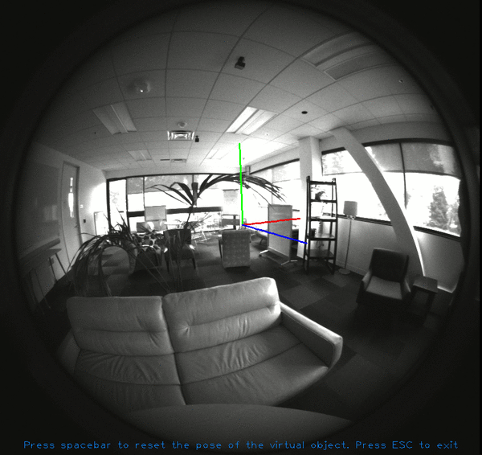
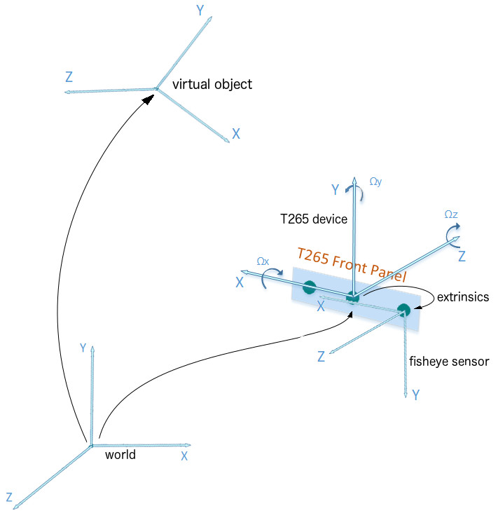

# rs-ar-basic Sample

> In order to run this example, a device supporting pose stream (T265) is required.

## Overview
This sample demonstrates how to obtain pose and fisheye data from a T265 device to create
a simple augmented reality application.
It also shows how to use the camera intrinsics and extrinsics API.

## Expected Output
The application should open a window in which it shows one of the fisheye streams with a virtual object in the scene. The virtual object is 3 red, green and blue segments.



## Code Overview

First, we include the Intel® RealSense™ Cross-Platform API.
```cpp
#include <librealsense2-framos/rs.hpp> // Include RealSense Cross Platform API
#include <librealsense2-framos/rsutil.h>
```

Then, we define some auxiliary types and functions. We define a "virtual object" as a
collection of vertices that will be connected by lines. Since our object are 3 segments,
we can describe them with 4 vertices: one at the origin, and one at the end of each segment.
```cpp
// We define a virtual object as a collection of vertices that will be connected by lines
typedef std::array<point3d, 4> object;
```

In the `main` function, we declare the pipeline and configure it with `RS2_STREAM_POSE` and `RS2_STREAM_FISHEYE` streams. Then, we start the pipeline.
```cpp
// Declare RealSense pipeline, encapsulating the actual device and sensors
rs2::pipeline pipe;
// Create a configuration for configuring the pipeline with a non default profile
rs2::config cfg;
// Enable fisheye and pose streams
cfg.enable_stream(RS2_STREAM_POSE, RS2_FORMAT_6DOF);
cfg.enable_stream(RS2_STREAM_FISHEYE, 1);
cfg.enable_stream(RS2_STREAM_FISHEYE, 2);
// Start pipeline with chosen configuration
rs2::pipeline_profile pipe_profile = pipe.start(cfg);
```

T265 provides two fisheye sensors we can use. We choose index 1 (left sensor), but it could be index 2 as well.
```cpp
// T265 has two fisheye sensors, we can choose any of them (index 1 or 2)
const int fisheye_sensor_idx = 1;
```

The intrinsics parameters of the sensor contain information about the fisheye distortion.
We will use these data to correctly project a virtual image on our image:
```cpp
// Get fisheye sensor intrinsics parameters
rs2::stream_profile fisheye_stream = pipe_profile.get_stream(RS2_STREAM_FISHEYE, fisheye_sensor_idx);
rs2_intrinsics intrinsics = fisheye_stream.as<rs2::video_stream_profile>().get_intrinsics();
```

The extrinsics parameters of the sensor contain its pose relative to the device coordinate system.
We will use them to compute the pose of a virtual object as seen from the sensor.
```cpp
// Get fisheye sensor extrinsics parameters.
// This is the pose of the fisheye sensor relative to the T265 coordinate system.
rs2_extrinsics extrinsics = fisheye_stream.get_extrinsics_to(pipe_profile.get_stream(RS2_STREAM_POSE));
```

We create an OpenGL window where we will show the fisheye image and the rendered virtual object.
```cpp
// Create an OpenGL display window and a texture to draw the fisheye image
window app(intrinsics.width, intrinsics.height, "Intel RealSense T265 Augmented Reality Example");
window_key_listener key_watcher(app);
texture fisheye_image;
```

Next, we define the shape of the virtual object we want to display. In this example, it is 4 vertices
that describe 3 segments.
```cpp
// Create the vertices of a simple virtual object.
// This virtual object is 4 points in 3D space that describe 3 XYZ 20cm long axes.
// These vertices are relative to the object's own coordinate system.
const float length = 0.20;
const object virtual_object = {{
    { 0, 0, 0 },      // origin
    { length, 0, 0 }, // X
    { 0, length, 0 }, // Y
    { 0, 0, length }  // Z
}};
```

We create a placeholder to store the pose of the virtual object in world coordinates,
which will be initialized after getting the first pose frame.
```cpp
// This variable will hold the pose of the virtual object in world coordinates.
// We we initialize it once we get the first pose frame.
rs2_pose object_pose_in_world;
bool object_pose_in_world_initialized = false;
```

After setting up the device and the scene, we run the main loop and iterate to get new poses and images
from the streams.
```cpp
// Main loop
while (app)
{
    rs2_pose device_pose_in_world; // This will contain the current device pose
```

We wait until new synchronized fisheye and pose frames are available.
```cpp
    {
        // Wait for the next set of frames from the camera
        auto frames = pipe.wait_for_frames();
        // Get a frame from the fisheye stream
        rs2::video_frame fisheye_frame = frames.get_fisheye_frame(fisheye_sensor_idx);
        // Get a frame from the pose stream
        rs2::pose_frame pose_frame = frames.get_pose_frame();
```

We get the current pose of the T265 device.
```cpp
        // Copy current camera pose
        device_pose_in_world = pose_frame.get_pose_data();
```

And we render the fisheye image in the application window.
```cpp
        // Render the fisheye image
        fisheye_image.render(fisheye_frame, { 0, 0, app.width(), app.height() });
```

Since we already have a copy of the data, we can deallocate frames so the Intel® RealSense™ framework can reuse them.
```cpp
        // By closing the current scope we let frames be deallocated,
        // so we do not fill up librealsense queues while we do other computation.
    }
```

We set the initial pose of the virtual object in world coordinates. This only happens in the first iteration of the main loop. Specifically, `reset_object_pose` sets the object 50cm in front of the camera.
```cpp
    // If we have not set the virtual object in the world yet, set it in front of the camera now.
    if (!object_pose_in_world_initialized)
    {
        object_pose_in_world = reset_object_pose(device_pose_in_world);
        object_pose_in_world_initialized = true;
    }
```

Once we have the current pose of the T265 device in world coordinates, we can compute
the pose of the virtual object relative to the fisheye sensor. To understand the necessary steps,
we have to pay attention to the coordinate systems involved in the problem:



We created a virtual object and set it in the world. Intel® RealSense™ provides us with the pose of the T265 device in world coordinates and the extrinsics give us the pose of the fisheye sensor relative to the T265 device. Now, we need to compute the pose of the virtual object relative to the fisheye sensor.

We proceed step by step. First, we compute the pose of the object relative to the device.
```cpp
    // Compute the pose of the object relative to the current pose of the device
    rs2_pose world_pose_in_device = pose_inverse(device_pose_in_world);
    rs2_pose object_pose_in_device = pose_multiply(world_pose_in_device, object_pose_in_world);
```

We convert the object vertices from object reference system into device reference system.
```cpp
    // Get the object vertices in device coordinates
    object object_in_device = convert_object_coordinates(virtual_object, object_pose_in_device);
```

Now we can use the extrinsics information of the fisheye sensor to transform vertices from
device reference system into sensor reference system. For that, the API provides `rs2_transform_point_to_point`:
```cpp
    // Convert object vertices from device coordinates into fisheye sensor coordinates using extrinsics
    object object_in_sensor;
    for (size_t i = 0; i < object_in_device.size(); ++i)
    {
        rs2_transform_point_to_point(object_in_sensor[i].f, &extrinsics, object_in_device[i].f);
    }
```

Before rendering the segments of the virtual object in the image, we are going to split the
segment into smaller pieces of 1cm in length. This way, we will be able to observe the fisheye distortion when
the virtual object is close to the device.
```cpp
    for (size_t i = 1; i < object_in_sensor.size(); ++i)
    {
        // Discretize the virtual object line into smaller 1cm long segments
        std::vector<point3d> points_in_sensor = raster_line(object_in_sensor[0], object_in_sensor[i], 0.01);
```

Once the object vertices are in sensor coordinates, we can check if they are in front or behind the camera. If they are behind the camera, we will not render them in the image. According to the figure above, if the Z coordinate is positive, then the vertex is in front of the sensor and we can use it.
```cpp
        for (auto& point : points_in_sensor)
        {
            // A 3D point is visible in the image if its Z coordinate relative to the fisheye sensor is positive.
            if (point.z() > 0)
```

If the point is visible, we can project it into the image by using the lens distortion information encoded by the intrinsics object. The function the API provides for this is `rs2_project_point_to_pixel`, which gives the pixel coordinates of a 3D point:
```cpp
            {
                // Project 3D sensor coordinates to 2D fisheye image coordinates using intrinsics
                projected_line.emplace_back();
                rs2_project_point_to_pixel(projected_line.back().f, &intrinsics, point.f);
            }
        }
```

Since we have the pixel coordinates of the segments, we can now draw them on the image.
```cpp
        // Display the line in the image
        render_line(projected_line, i);
    }
```

Finally, we render some text on the image.
```cpp
    // Display text in the image
    render_text(app.height(), "Press spacebar to reset the pose of the virtual object. Press ESC to exit");
```

At this point, our application has shown the current fisheye image with a rendered virtual object on it to the user. To control the flow of the program, we check if the user presses any key.
```cpp
    // Check if some key is pressed
    switch (key_watcher.get_key())
    {
```

If the user presses spacebar, we move the virtual object in front of the camera again.
```cpp
    case GLFW_KEY_SPACE:
        // Reset virtual object pose if user presses spacebar
        object_pose_in_world = reset_object_pose(device_pose_in_world);
        std::cout << "Setting new pose for virtual object: " << object_pose_in_world.translation << std::endl;
        break;
```

If the user presses escape, we close the window to exit the application.
```cpp
    case GLFW_KEY_ESCAPE:
        // Exit if user presses escape
        app.close();
        break;
    }
}
```
